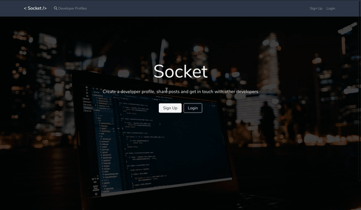

# Socket- A Social Network for Developers

This is a MongoDB, ExpressJS, ReactJS, NodeJS (MERN) Stack Web Application.

 

You can view a hosted instance of Socket [here](https://salty-everglades-17999.herokuapp.com)

# Set up locally

    $ git clone https://github.com/abdamin/socket-socialnetwork.git
    $ npm install
    $ npm run build
    $ npm start

# App Info

<h4>Author<h4/>  
Abdullah Amin
